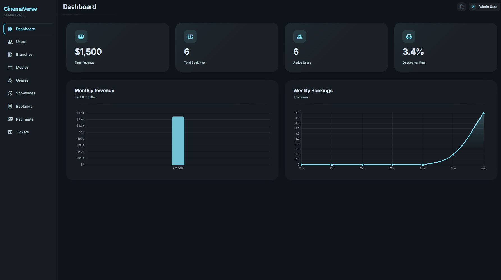
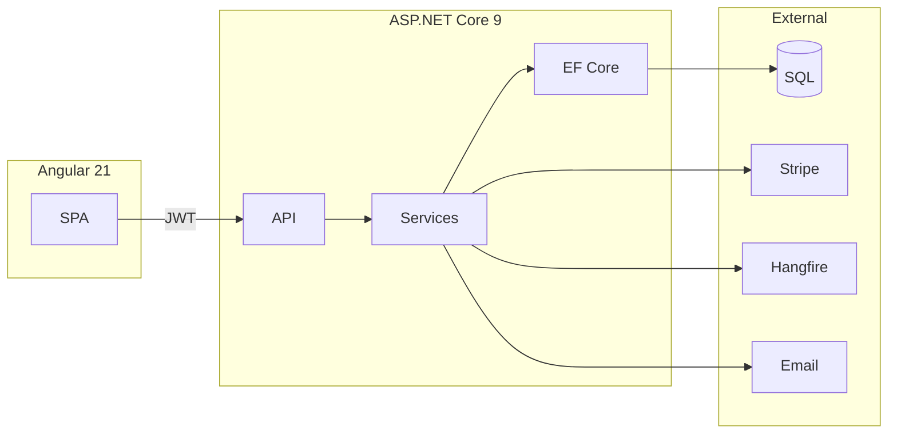
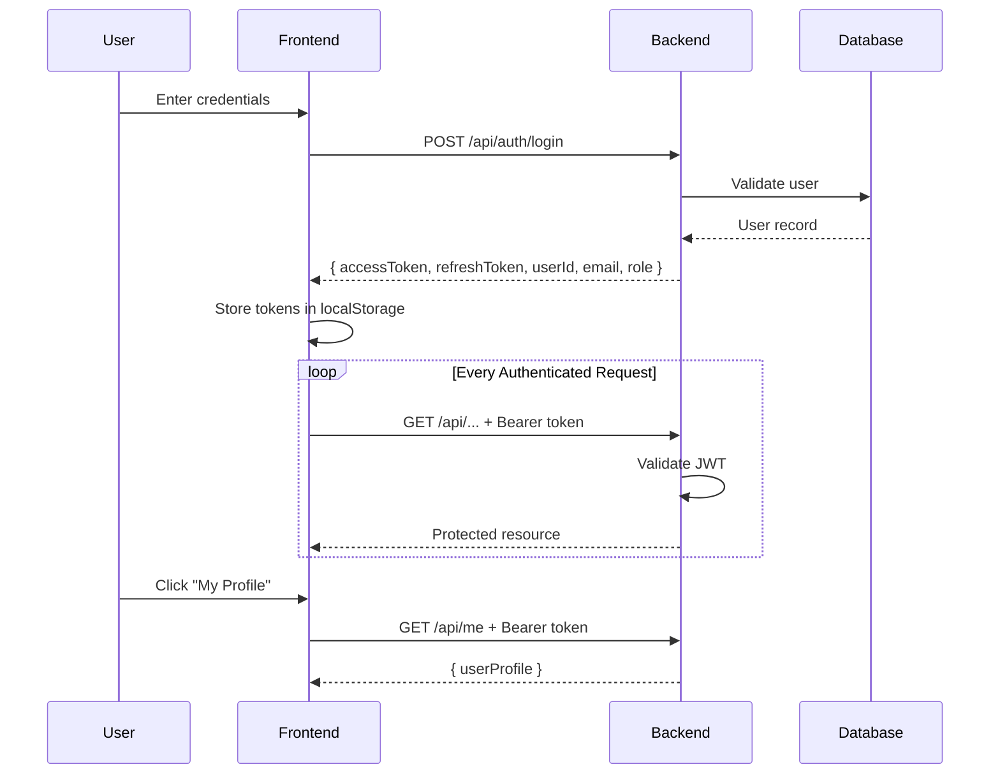
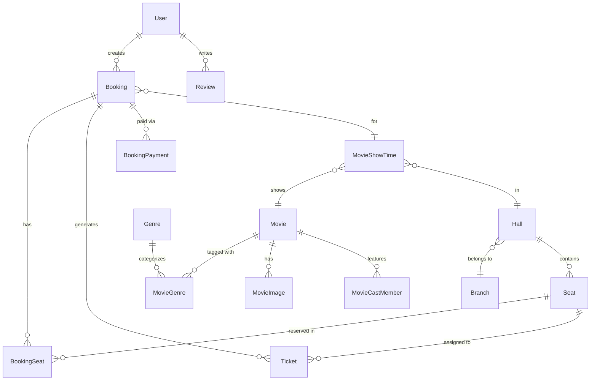

# CinemaVerse

[](https://angular.dev/)
[](https://dotnet.microsoft.com/)
[](https://www.microsoft.com/en-us/sql-server)
[](https://stripe.com/)
[](LICENSE)

> A complete cinema ticket booking platform built with **Angular 21** (frontend) and **ASP.NET Core 9.0** (backend), featuring user authentication, movie browsing, seat selection, Stripe payments, QR code tickets, and a full admin panel.

---

## Table of Contents

- [Features](#features)
  - [User Features](#user-features)
  - [Admin Features](#admin-features)
- [Tech Stack](#tech-stack)
- [Architecture](#architecture)
- [Database](#database)
- [Authentication](#authentication)
- [API Documentation](#api-documentation)

---

## Features

### User Features

#### Movie Browsing

Browse movies with search, genre, and language filters. View movie info, cast, images, and available showtimes.

| Home Page |
|:---------:|
|  |

| Movie Listing | Movie Detail |
|:-------------:|:------------:|
|  |  |

---

#### Seat Selection & Booking

Interactive seat grid with real-time availability, Stripe payment integration, and QR code ticket generation.

| Booking | Payment |
|---------|---------|
|  |  |

---

### Admin Features

#### Dashboard

KPI cards, revenue charts, booking trends, and occupancy rate at a glance.

| Dashboard |
|-----------|
|  |

---

#### Movies Management

Full CRUD with media upload, genre assignment, and detailed movie views.

| Movies List | View Movie |
|-------------|------------|
|  |  |

---

#### Branches & Halls

Manage cinema branches, hall configurations, seat layouts, and hall types (2D, 3D, IMAX, VIP).

| Branches | View Branch | Edit Hall |
|----------|-------------|-----------|
|  |  |  |

---

#### Showtimes

Schedule showtimes with conflict detection across halls and movies.

| Showtimes |
|-----------|
|  |

---

#### Users Management

View, create, edit, activate/deactivate user accounts with role-based access control.

| Users | View User |
|-------|-----------|
|  |  |

---

#### Bookings Management

View all bookings, update status, and export to CSV.

| Bookings |
|----------|
|  |

---

#### Tickets Management

QR code lookup and check-in management for ticket validation.

| Tickets | View Ticket |
|---------|-------------|
|  |  |

---

## Tech Stack

| Frontend | Backend |
|----------|---------|
| Angular 21.2 | ASP.NET Core 9.0 |
| TypeScript 5.9 | Entity Framework Core 9.0 |
| SCSS + Bootstrap 5.3 | SQL Server |
| Chart.js 4.5 | JWT Bearer 8.15 |
| RxJS 7.8 | Stripe.net 50.2 |
| Angular Signals | Hangfire 1.8 |
| Vitest 4.0 | MailKit 4.1 / RazorLight 2.2 |
| | BCrypt.Net 4.0 / Serilog 8.0 |

---

## Architecture



---

## API Documentation

### Swagger UI

Access the interactive API documentation at:

```
https://cinemaverse.tryasp.net/swagger/index.html
```

### API Endpoints Summary

| Category | Endpoints | Auth |
|----------|-----------|------|
| Auth | 8 | Public |
| User (Profile, Bookings, Tickets, Payments, Reviews) | 17 | Required |
| Public (Movies, Seats) | 3 | Public |
| Admin (Users, Movies, Branches, Halls, Genres, Showtimes, Bookings, Payments, Tickets, Media) | 66 | Admin |
| **Total** | **94** | |

### Standard Response Format

```json
// Success (200 OK)
{ "data": "...", "message": "Success" }

// Paginated Success
{
  "items": [...],
  "page": 1,
  "totalCount": 100,
  "pageSize": 10,
  "totalPages": 10
}

// Error (400/401/403/404/500)
{
  "type": "https://tools.ietf.org/html/rfc7231#section-6.5.1",
  "title": "Bad Request",
  "status": 400,
  "errors": {
    "FieldName": ["Error message"]
  }
}
```

---

## Authentication

### JWT Configuration

| Setting | Value |
|---------|-------|
| Issuer | `CinemaVerseApi` |
| Audience | `CinemaVerseApiUsers` |
| Access Token Expiry | 60 minutes |
| Refresh Token Expiry | 7 days |
| Signing Algorithm | HMAC-SHA256 |
| Password Hashing | BCrypt (work factor 10+) |

### Auth Flow



> **Note:** Access tokens expire after 60 minutes. Refresh tokens are valid for 7 days and enable silent token renewal without requiring the user to log in again.

### Token Storage

| Key | Purpose |
|-----|---------|
| `cinemaverse_token` | JWT access token |
| `cv_refresh_token` | Refresh token for silent renewal |
| `cv_role` | Cached user role |

### Rate Limiting

Auth endpoints are rate-limited to **5 requests per minute per IP**:
- `POST /api/auth/login`
- `POST /api/auth/refresh-token`
- `POST /api/auth/logout`

---

## Database

The database consists of 17 entities with clear relationships for users, movies, bookings, and cinema management.



---

## Background Jobs

Powered by **Hangfire** with SQL Server storage.

| Job | Schedule | Purpose |
|-----|----------|---------|
| `ExpirePendingBookings` | Every minute | Cancel unpaid bookings after timeout |
| `SendShowReminders` | Every 15 minutes | Email reminders for upcoming shows |

### Hangfire Dashboard

Access at `https://cinemaverse.tryasp.net/hangfire` (Admin-only).

---

## Authors

| Name | Role | GitHub |
|------|------|--------|
| **Nour Eldeen Mahmoud** | Backend | [@NourEldeenMahmoud](https://github.com/NourEldeenMahmoud) |
| **Omar Aboelkheir** | Backend | [@OmarAbouelkheirr](https://github.com/OmarAbouelkheirr) |
| **Ahmed Kamal** | Frontend | [@butalib](https://github.com/butalib) |

---

## Acknowledgments

- [Angular](https://angular.dev/) — Frontend framework
- [ASP.NET Core](https://learn.microsoft.com/en-us/aspnet/core/) — Backend framework
- [Stripe](https://stripe.com/docs) — Payment processing
- [Hangfire](https://hangfire.io/) — Background job processing
- [MailKit](https://github.com/jstedfast/MailKit) — Email sending
- [Chart.js](https://www.chartjs.org/) — Dashboard charts
