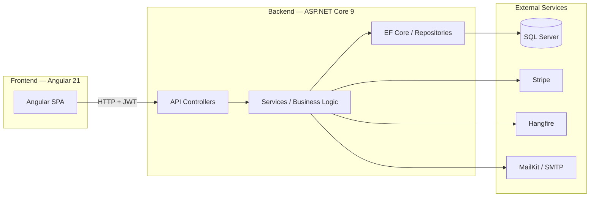
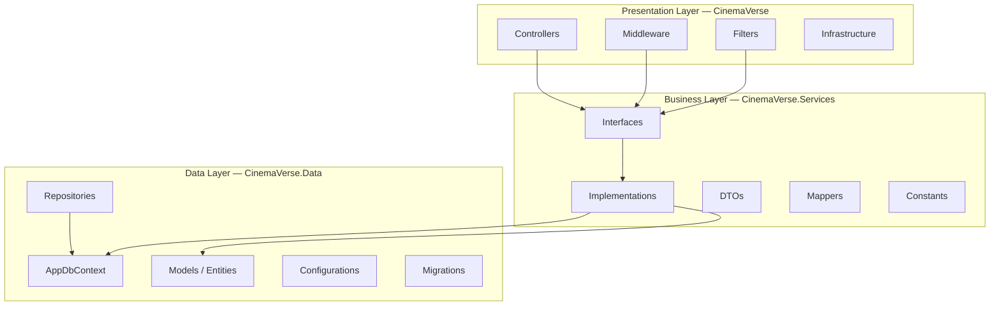
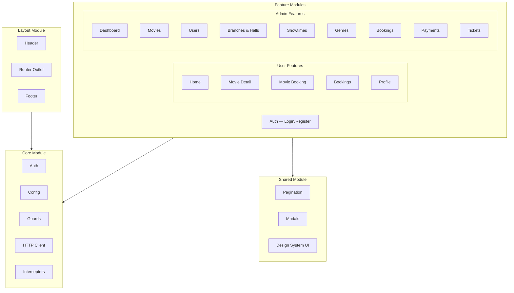
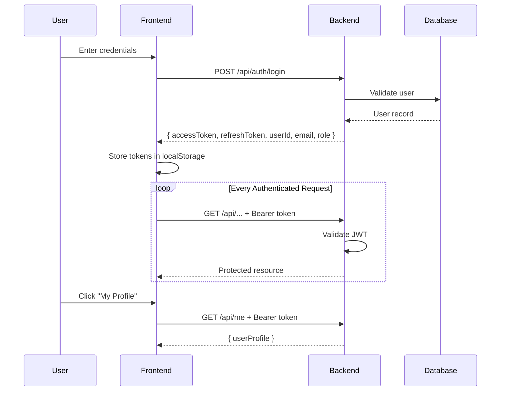
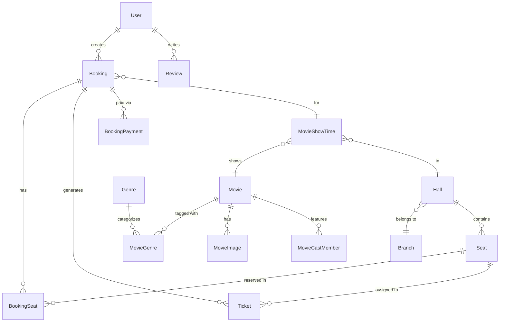

# CinemaVerse

[](https://angular.dev/)
[](https://dotnet.microsoft.com/)
[](https://www.microsoft.com/en-us/sql-server)
[](https://stripe.com/)
[](LICENSE)

> A complete cinema ticket booking platform built with **Angular 21** (frontend) and **ASP.NET Core 9.0** (backend), featuring user authentication, movie browsing, seat selection, Stripe payments, QR code tickets, and a full admin panel.

---

## Table of Contents

- [Live Demo](#live-demo)
- [Features](#features)
  - [User Features](#user-features)
    - [Movie Browsing](#movie-browsing)
    - [Seat Selection & Booking](#seat-selection--booking)
  - [Admin Features](#admin-features)
    - [Dashboard](#dashboard)
    - [Movies Management](#movies-management)
    - [Branches & Halls](#branches--halls)
    - [Showtimes](#showtimes)
    - [Users Management](#users-management)
    - [Bookings Management](#bookings-management)
    - [Tickets Management](#tickets-management)
- [Tech Stack](#tech-stack)
- [Architecture](#architecture)
  - [System Overview](#system-overview)
  - [Backend — Clean Architecture](#backend--clean-architecture)
  - [Frontend — Angular Architecture](#frontend--angular-architecture)
- [Database](#database)
  - [Entity Relationship Diagram](#entity-relationship-diagram)
- [Authentication](#authentication)
- [Getting Started](#getting-started)
- [API Documentation](#api-documentation)
- [Deployment](#deployment)
- [Test Credentials](#test-credentials)
- [Known Issues](#known-issues)
- [Contributing](#contributing)

---

## Live Demo

| Service | URL |
|---------|-----|
| **Frontend** | [https://butalib.github.io/cinmaVerse/login](https://butalib.github.io/cinmaVerse/login) |
| **Backend API** | [https://cinemaverse.tryasp.net](https://cinemaverse.tryasp.net) |
| **Swagger UI** | [https://cinemaverse.tryasp.net/swagger/index.html](https://cinemaverse.tryasp.net/swagger/index.html) |

---

## Features

### User Features

#### Movie Browsing

Browse movies with search, genre, and language filters. View movie info, cast, images, and available showtimes.

| Home Page | Movie Listing | Movie Detail |
|-----------|--------------|--------------|
|  |  |  |

---

#### Seat Selection & Booking

Interactive seat grid with real-time availability, Stripe payment integration, and QR code ticket generation.

| Booking | Payment |
|---------|---------|
|  |  |

---

### Admin Features

#### Dashboard

KPI cards, revenue charts, booking trends, and occupancy rate at a glance.

| Dashboard |
|-----------|
|  |

---

#### Movies Management

Full CRUD with media upload, genre assignment, and detailed movie views.

| Movies List | View Movie |
|-------------|------------|
|  |  |

---

#### Branches & Halls

Manage cinema branches, hall configurations, seat layouts, and hall types (2D, 3D, IMAX, VIP).

| Branches | View Branch | Edit Hall |
|----------|-------------|-----------|
|  |  |  |

---

#### Showtimes

Schedule showtimes with conflict detection across halls and movies.

| Showtimes |
|-----------|
|  |

---

#### Users Management

View, create, edit, activate/deactivate user accounts with role-based access control.

| Users | View User |
|-------|-----------|
|  |  |

---

#### Bookings Management

View all bookings, update status, and export to CSV.

| Bookings |
|----------|
|  |

---

#### Tickets Management

QR code lookup and check-in management for ticket validation.

| Tickets | View Ticket |
|---------|-------------|
|  |  |

---

## Tech Stack

### Frontend

| Technology | Version | Purpose |
|------------|---------|---------|
| Angular | 21.2.x | UI framework (standalone components) |
| TypeScript | 5.9.x | Type-safe JavaScript |
| SCSS | — | Styling with custom design system |
| Bootstrap | 5.3.8 | CSS utility classes |
| Chart.js | 4.5.1 | Dashboard charts |
| RxJS | 7.8.x | Reactive programming |
| Angular Signals | — | State management |
| Vitest | 4.0.8 | Unit testing |

### Backend

| Technology | Version | Purpose |
|------------|---------|---------|
| ASP.NET Core | 9.0 | Web API framework |
| Entity Framework Core | 9.0 | ORM / Database access |
| SQL Server | — | Database |
| JWT Bearer | 8.15.0 | Authentication |
| Stripe.net | 50.2.0 | Payment processing |
| Hangfire | 1.8.23 | Background job processing |
| MailKit | 4.14.1 | Email sending |
| RazorLight | 2.2.0 | Email templates |
| BCrypt.Net | 4.0.3 | Password hashing |
| Serilog | 8.0.3 | Structured logging |
| Swashbuckle | 6.5.0 | API documentation |

---

## Architecture

### System Overview



> **Note:** The frontend communicates with the backend via RESTful APIs using JWT authentication. External services like Stripe for payments, Hangfire for background jobs, and MailKit for emails are integrated at the service layer.

---

### Backend — Clean Architecture

The backend follows Clean Architecture with three distinct layers, ensuring separation of concerns and testability.



> **Key Principles:**
> - **Dependency Inversion:** Business layer defines interfaces; implementation details live in outer layers
> - **Repository Pattern:** Data access is abstracted behind repository interfaces
> - **Unit of Work:** Transaction management across multiple repositories

---

### Frontend — Angular Architecture

The frontend follows a modular architecture with lazy-loaded feature modules and shared components.



> **Key Principles:**
> - **Standalone Components:** Angular 21 standalone components without NgModules
> - **Signal-Based State:** Using Angular Signals for reactive state management
> - **Lazy Loading:** Feature modules are lazy-loaded for optimal bundle size

---

## Getting Started

### Prerequisites

| Requirement | Version |
|-------------|---------|
| .NET SDK | 9.0+ |
| Node.js | 18+ |
| npm | 9+ |
| SQL Server | 2019+ (or Azure SQL) |
| Stripe Account | For payment processing |

> **Note:** Make sure all prerequisites are installed before proceeding with the setup.

### Backend Setup

```bash
# 1. Navigate to backend
cd "CinemaVerse Backend/src"

# 2. Restore dependencies
dotnet restore

# 3. Update connection string in CinemaVerse/appsettings.json
# "ConnectionStrings": {
#   "DefaultConnection": "Server=.;Database=CinemaVerseDb;Trusted_Connection=true;TrustServerCertificate=true"
# }

# 4. Update Stripe key in appsettings.json
# "Stripe": {
#   "SecretKey": "sk_test_your_stripe_secret_key"
# }

# 5. Run migrations and seed data
dotnet ef database update --project CinemaVerse.Data --startup-project CinemaVerse

# 6. Run the API
cd CinemaVerse
dotnet run

# API will be available at https://localhost:5001 or http://localhost:5000
```

> **Tip:** Use `dotnet ef database update` to run migrations before starting the API. This will create the database and seed initial data.

### Frontend Setup

```bash
# 1. Navigate to frontend
cd "CinmaVerse Front"

# 2. Install dependencies
npm install

# 3. Update API URL in src/app/core/config/api.config.ts
# For local development:
# export const API_BASE_URL = 'https://localhost:5001';

# 4. Start development server
npm start

# Frontend will be available at http://localhost:4200
```

---

## API Documentation

### Swagger UI

Access the interactive API documentation at:

```
https://cinemaverse.tryasp.net/swagger/index.html
```

### API Endpoints Summary

| Category | Endpoints | Auth |
|----------|-----------|------|
| Auth | 8 | Public |
| User Profile | 3 | Required |
| Movies (Public) | 2 | Public |
| Hall Seats | 1 | Public |
| User Bookings | 4 | Required |
| User Tickets | 2 | Required |
| User Payments | 3 | Required |
| User Reviews | 5 | Required |
| Admin Dashboard | 7 | Admin |
| Admin Users | 9 | Admin |
| Admin Movies | 6 | Admin |
| Admin Branches | 7 | Admin |
| Admin Halls | 5 | Admin |
| Admin Genres | 5 | Admin |
| Admin Showtimes | 5 | Admin |
| Admin Bookings | 7 | Admin |
| Admin Payments | 3 | Admin |
| Admin Tickets | 6 | Admin |
| Admin Media | 1 | Admin |
| **Total** | **94** | |

### Standard Response Format

```json
// Success (200 OK)
{ "data": "...", "message": "Success" }

// Paginated Success
{
  "items": [...],
  "page": 1,
  "totalCount": 100,
  "pageSize": 10,
  "totalPages": 10
}

// Error (400/401/403/404/500)
{
  "type": "https://tools.ietf.org/html/rfc7231#section-6.5.1",
  "title": "Bad Request",
  "status": 400,
  "errors": {
    "FieldName": ["Error message"]
  }
}
```

---

## Authentication

### JWT Configuration

| Setting | Value |
|---------|-------|
| Issuer | `CinemaVerseApi` |
| Audience | `CinemaVerseApiUsers` |
| Access Token Expiry | 60 minutes |
| Refresh Token Expiry | 7 days |
| Signing Algorithm | HMAC-SHA256 |
| Password Hashing | BCrypt (work factor 10+) |

### Auth Flow



> **Note:** Access tokens expire after 60 minutes. Refresh tokens are valid for 7 days and enable silent token renewal without requiring the user to log in again.

### Token Storage

| Key | Purpose |
|-----|---------|
| `cinemaverse_token` | JWT access token |
| `cv_refresh_token` | Refresh token for silent renewal |
| `cv_role` | Cached user role |

### Rate Limiting

Auth endpoints are rate-limited to **5 requests per minute per IP**:
- `POST /api/auth/login`
- `POST /api/auth/refresh-token`
- `POST /api/auth/logout`

---

## Database

### Entity Relationship Diagram

The database consists of 17 entities with clear relationships for users, movies, bookings, and cinema management.



### Entities (17 Total)

| Entity | Key Fields |
|--------|-----------|
| **User** | Id, Email, PasswordHash, FirstName, LastName, Role, IsActive, IsEmailConfirmed |
| **Movie** | Id, MovieName, MovieDescription, MoviePoster, MovieDuration, MovieRating, Status |
| **Branch** | Id, BranchName, BranchLocation |
| **Hall** | Id, BranchId, HallNumber, HallType, Capacity, HallStatus |
| **Seat** | Id, HallId, SeatLabel |
| **Genre** | Id, GenreName |
| **MovieGenre** | MovieID, GenreID (many-to-many) |
| **MovieShowTime** | Id, HallId, MovieId, ShowStartTime, ShowEndTime, Price |
| **Booking** | Id, UserId, MovieShowTimeId, Status, TotalAmount, ExpiresAt |
| **BookingSeat** | BookingId, SeatId (many-to-many) |
| **Ticket** | Id, BookingId, SeatId, Price, Status, TicketNumber, QrToken |
| **BookingPayment** | Id, BookingId, Amount, Currency, PaymentIntentId, Status |
| **Review** | Id, UserId, MovieId, Rating, Comment |
| **MovieImage** | Id, MovieId, ImageUrl |
| **MovieCastMember** | Id, MovieId, PersonName, RoleType, CharacterName |

### Enums

| Enum | Values |
|------|--------|
| `UserRole` | Admin(1), User(2) |
| `MovieStatus` | Draft(0), Active(1), Archived(2), ComingSoon(3) |
| `BookingStatus` | Pending(0), Confirmed(1), Cancelled(2), Expired(3) |
| `TicketStatus` | Active(0), Used(1), Cancelled(2) |
| `PaymentStatus` | Pending(0), Completed(1), Failed(2), Refunded(3) |
| `HallType` | TwoD(0), ThreeD(1), IMAX(2), VIP(3) |
| `HallStatus` | Available(0), UnderMaintenance(1) |
| `MovieAgeRating` | G(0), PG(1), PG13(2), R(3), NC17(4) |
| `Genders` | Male(0), Female(1), Other(2) |
| `CastRoleType` | Actor(0), Director(1), Producer(2) |

---

## Background Jobs

Powered by **Hangfire** with SQL Server storage.

| Job | Schedule | Purpose |
|-----|----------|---------|
| `ExpirePendingBookings` | Every minute | Cancel unpaid bookings after timeout |
| `SendShowReminders` | Every 15 minutes | Email reminders for upcoming shows |

### Hangfire Dashboard

Access at `https://cinemaverse.tryasp.net/hangfire` (Admin-only).

---

## Email System

### Email Types

| Type | Template | Trigger |
|------|----------|---------|
| Welcome | `welcome.cshtml` | After registration |
| Email Verification | `verification.cshtml` | After registration |
| Password Reset | `password-reset.cshtml` | On forgot password request |
| Booking Confirmation | `booking-confirmation.cshtml` | After payment success |
| Booking Cancellation | `booking-cancellation.cshtml` | On booking cancellation |
| Show Reminder | `show-reminder.cshtml` | 2 hours before showtime |
| Payment Confirmation | `payment-confirmation.cshtml` | After payment success |

### SMTP Configuration

| Setting | Value |
|---------|-------|
| Server | `smtp.gmail.com` |
| Port | 587 |
| Security | STARTTLS |
| Authentication | App password |

---

## Deployment

> **Warning:** Never commit secrets (Stripe keys, JWT secrets, database credentials) to version control. Use environment variables in production.

### Frontend (GitHub Pages)

```bash
# Build for production
cd "CinmaVerse Front"
npm run build

# Output: dist/cinmaverse-web/browser/
# Deploy to GitHub Pages via CI/CD or manual upload
```

### Backend (Azure / Any .NET Host)

```bash
# Publish
dotnet publish -c Release -o ./publish

# Deploy publish/ folder to your hosting provider
```

### Environment Variables

| Variable | Purpose | Example |
|----------|---------|---------|
| `ConnectionStrings__DefaultConnection` | Database connection | `Server=...;Database=CinemaVerseDb;...` |
| `Jwt__Secret` | JWT signing key | `your-256-bit-secret` |
| `Stripe__SecretKey` | Stripe API key | `sk_test_...` |
| `Email__From` | Sender email | `noreply@cinemaverse.com` |
| `Email__Password` | SMTP app password | `your-app-password` |
| `SeedData__AllowInProduction` | Allow seeding in prod | `false` |

---

## Test Credentials

| Role | Email | Password |
|------|-------|----------|
| **Admin** | `admin@cinemaverse.local` | `YourAdminPassword123!` |
| **User** | `user@cinemaverse.local` | `User@12345` |

> **Warning:** These are development credentials only. Never use them in production. Production credentials are generated during deployment.

---

## Known Issues

> **Note:** These issues are documented for transparency. Contributions to fix them are welcome!

### Critical

| Issue | Description |
|-------|-------------|
| Payment confirm response shape | Backend returns raw `bool`, frontend expects `{ success, message }` |
| Movie status mapper | Frontend sends `"NowShowing"` / `"Draft"`, backend expects `"Active"` / `"Archived"` |
| User booking missing `userId` query | Detail/cancel calls omit required `?userId=X` parameter |
| Refresh interceptor | Only clears session, doesn't attempt token refresh |

### High

| Issue | Description |
|-------|-------------|
| Login doesn't save refresh token | Logout sends empty refresh token |
| Hardcoded `userId: 1` | Admin booking creation always uses user ID 1 |
| Genre ID mismatch | Frontend uses `id`, backend returns `genreId` |
| Admin user create missing DOB validation | Form allows blank dateOfBirth |

### Medium

| Issue | Description |
|-------|-------------|
| Hall seats branch shape | Backend sends string, frontend expects object |
| Seat column type | Backend sends string, frontend expects number |
| Cast image URL validation | Empty string fails backend `[Url]` validation |

> See `AI_PROJECT_ANALYSIS/FRONTEND_BACKEND_MISMATCHES.md` for full details.

---

## Contributing

1. Fork the repository
2. Create a feature branch (`git checkout -b feature/amazing-feature`)
3. Commit your changes (`git commit -m 'Add amazing feature'`)
4. Push to the branch (`git push origin feature/amazing-feature`)
5. Open a Pull Request

### Development Guidelines

- Follow Angular style guide for frontend
- Follow ASP.NET Core conventions for backend
- Write unit tests for new features
- Update API documentation for new endpoints
- Run linter before committing

---

## License

This project is licensed under the MIT License — see the [LICENSE](LICENSE) file for details.

---

## Author

**Nour Eldeen** — [GitHub](https://github.com/butalib)

---

## Acknowledgments

- [Angular](https://angular.dev/) — Frontend framework
- [ASP.NET Core](https://learn.microsoft.com/en-us/aspnet/core/) — Backend framework
- [Stripe](https://stripe.com/docs) — Payment processing
- [Hangfire](https://hangfire.io/) — Background job processing
- [MailKit](https://github.com/jstedfast/MailKit) — Email sending
- [Chart.js](https://www.chartjs.org/) — Dashboard charts
